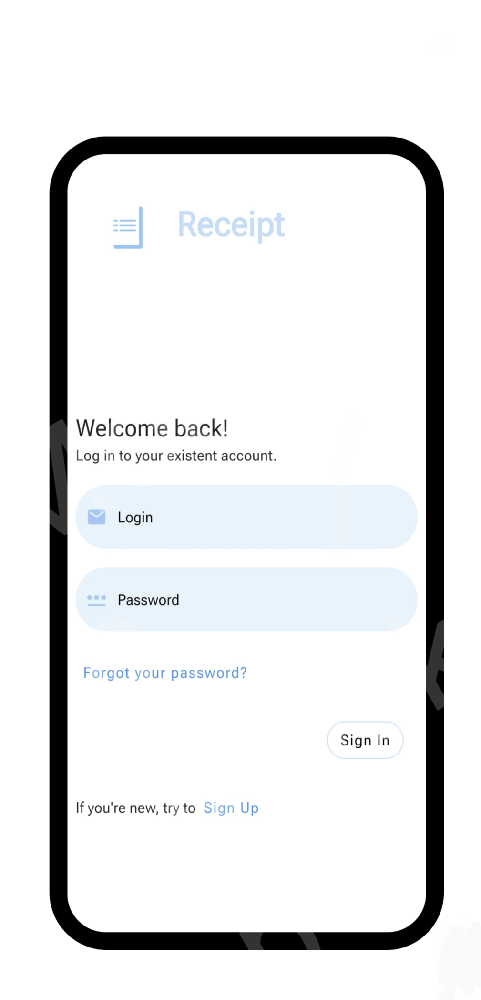
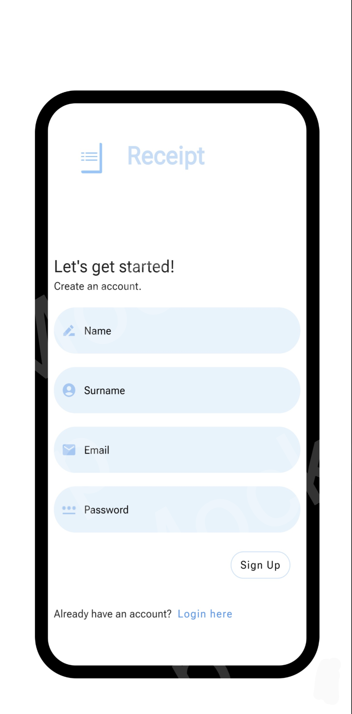
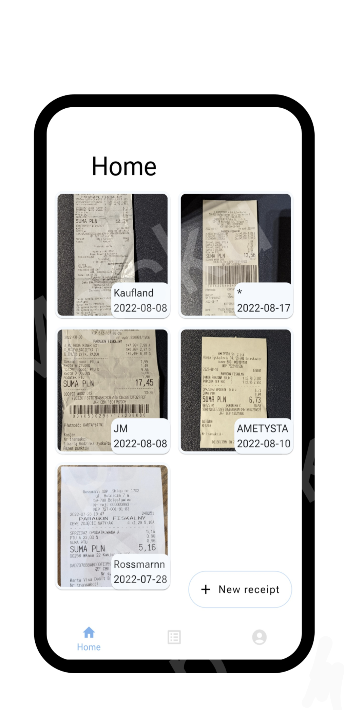
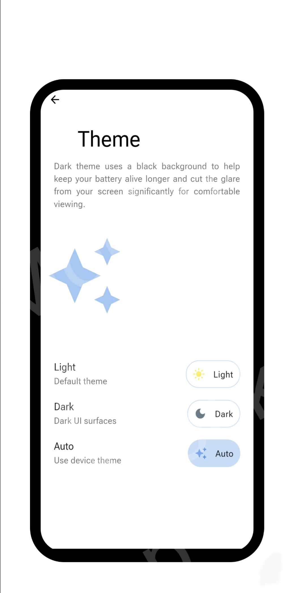

# Receipt

## Table of Contents
* [General Info](#general-information)
* [Technologies Used](#technologies-used)
* [Features](#features)
* [Screenshots](#screenshots)
* [Setup](#setup)
* [Usage](#usage)
* [Project Status](#project-status)
* [Room for Improvement](#room-for-improvement)
* [Acknowledgements](#acknowledgements)
* [Contact](#contact)
<!-- * [License](#license) -->

## General Information
- Storage at home can be a challenge. Receipt will help you keep track of all your sale receipts in one place.

## Technologies Used
- Flutter.
- Dart.
- Provider for state management.
- Firebases storage.
- Firebase auth.
- Google ML Kit for text recognition.
- Implicit flutter animation.

## Features
List the ready features here:
- Authentication.
- Load into Firebase sale receipts from your device local storage.
- Delete from Firebase sale receipts.
- Add your profile information (profile image, name, surname, email).
- Dark/Light/Auto theme.

## Screenshots
 
 

## Setup
- Click on the green-colored Code button then copy the hyperlink. You may copy the link manually or by just click on the Copy icon. 
- Open your Android Studio then go to the File > New > Project from Version Control.
- In the Version control choose Git from the drop-down menu. 
- Then at last paste the link in the URL and choose your Directory. Click on the Clone button and you are done.

## Usage
Will be added soon

`write-your-code-here`

## Project Status
Project is: _in progress_.

## Room for Improvement
- Improvement to be done: project architecture.

To do:
- Feature to be added: 
Journal - place where user can see history of all added receipts.
Your info - for editing personal information.

## Acknowledgements
- This project was based on [this tutorial](https://www.youtube.com/playlist?list=PL4cUxeGkcC9j--TKIdkb3ISfRbJeJYQwC).

## Contact
Created by [@Nexlay](https://twitter.com/Nexlay/) - feel free to contact me!

<!-- Optional -->
<!-- ## License -->
<!-- This project is open source and available under the [... License](). -->

<!-- You don't have to include all sections - just the one's relevant to your project -->
